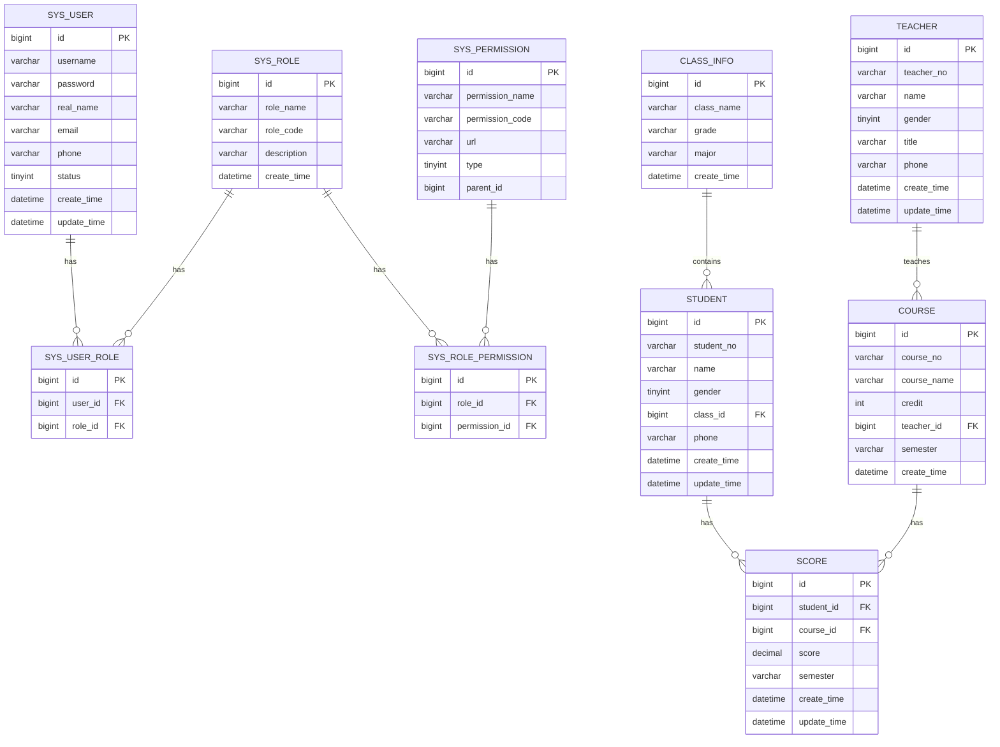

# 学生成绩管理系统 ER图

```mermaid
erDiagram
    SYS_USER ||--o{ SYS_USER_ROLE : has
    SYS_ROLE ||--o{ SYS_USER_ROLE : has
    SYS_ROLE ||--o{ SYS_ROLE_PERMISSION : has
    SYS_PERMISSION ||--o{ SYS_ROLE_PERMISSION : has
    STUDENT ||--o{ SCORE : has
    COURSE ||--o{ SCORE : has
    TEACHER ||--o{ COURSE : teaches
    CLASS_INFO ||--o{ STUDENT : contains

    SYS_USER {
        bigint id PK
        varchar username
        varchar password
        varchar real_name
        varchar email
        varchar phone
        tinyint status
        datetime create_time
        datetime update_time
    }

    SYS_ROLE {
        bigint id PK
        varchar role_name
        varchar role_code
        varchar description
        datetime create_time
    }

    SYS_PERMISSION {
        bigint id PK
        varchar permission_name
        varchar permission_code
        varchar url
        tinyint type
        bigint parent_id
    }

    SYS_USER_ROLE {
        bigint id PK
        bigint user_id FK
        bigint role_id FK
    }

    SYS_ROLE_PERMISSION {
        bigint id PK
        bigint role_id FK
        bigint permission_id FK
    }

    STUDENT {
        bigint id PK
        varchar student_no
        varchar name
        tinyint gender
        bigint class_id FK
        varchar phone
        datetime create_time
        datetime update_time
    }

    TEACHER {
        bigint id PK
        varchar teacher_no
        varchar name
        tinyint gender
        varchar title
        varchar phone
        datetime create_time
        datetime update_time
    }

    COURSE {
        bigint id PK
        varchar course_no
        varchar course_name
        int credit
        bigint teacher_id FK
        varchar semester
        datetime create_time
    }

    SCORE {
        bigint id PK
        bigint student_id FK
        bigint course_id FK
        decimal score
        varchar semester
        datetime create_time
        datetime update_time
    }

    CLASS_INFO {
        bigint id PK
        varchar class_name
        varchar grade
        varchar major
        datetime create_time
    }
```
